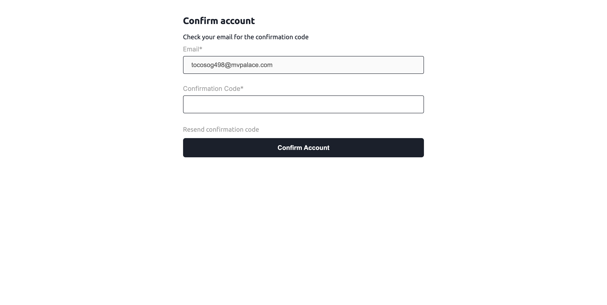
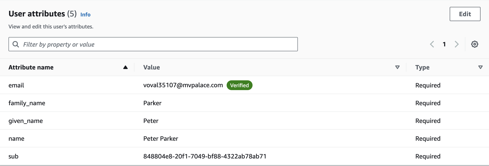

<h1>AWS Cognito Integration with Amplify + Nextjs</h1>

<h4>[Feature Request](https://github.com/apettiigrew/aws-cognito-nextjs-app/issues/)</h4>

 

## :star2: About the Project

This project illustrates how to integrate AWS Cognito using Amplify with NextJs. There is blog post that supports how this was done as this project will not work without setting up the AWS User pools.

Users should be able to perform the following using AWS Cognito
- Create an account
- Login
- Forgot Password
- Social Login with Google

<!-- Screenshots -->

### :camera: Screenshots

<!-- TechStack -->

### :space_invader: Tech Stack

<ul>
<li><a href="https://docs.aws.amazon.com/cognito/">AWS Cognito</a></li>
<li><a href="https://docs.amplify.aws/">AWS Amplify</a></li>
<li><a href="https://www.typescriptlang.org/">Typescript</a></li>
<li><a href="https://nextjs.org/">Next.js</a></li>
<li><a href="https://reactjs.org/">React.js</a></li>
<li><a href="https://sass-lang.com/">Sass</a></li>
<li><a href="https://formik.org/">Formik</a></li>
</ul>

## :wave: Contributing

Contributions are always welcome!

<!-- Acknowledgments -->

## :gem: Acknowledgements

Use this section to mention useful resources and libraries that you have used in your projects.

- [Shields.io](https://shields.io/)
- [Awesome README](https://github.com/matiassingers/awesome-readme)
- [Emoji Cheat Sheet](https://github.com/ikatyang/emoji-cheat-sheet/blob/master/README.md#travel--places)
- [Readme Template](https://github.com/othneildrew/Best-README-Template)
